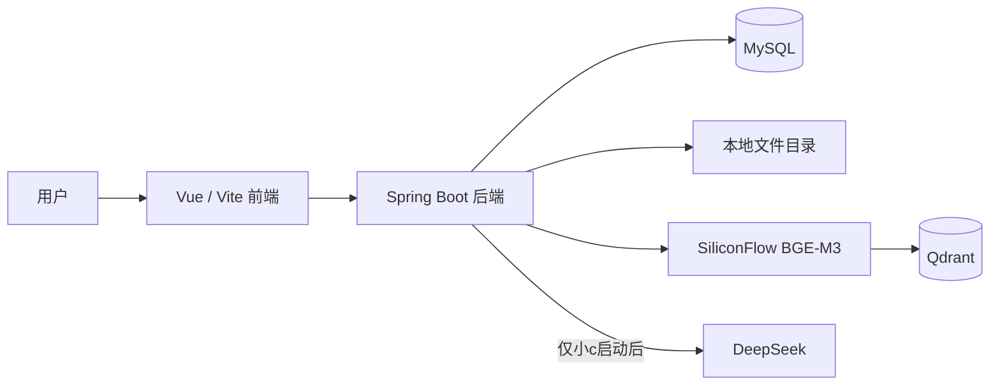
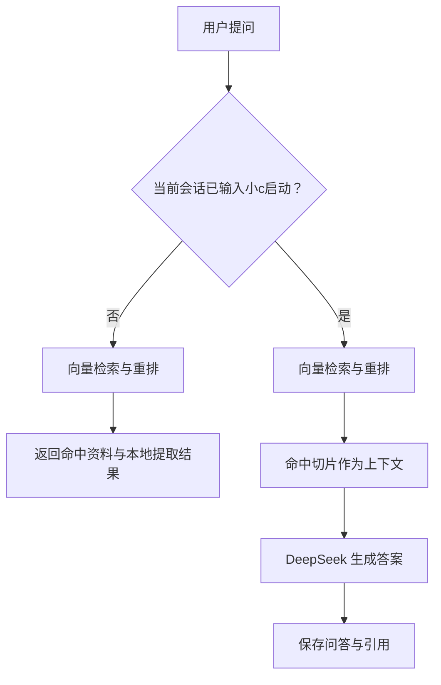

# NPC Base Knowledge Base

NPC Base 是一个个人知识库问答系统。第一阶段已经完成：资料可上传、解析、切片、向量化、语义检索、对话归档，以及按需启用 DeepSeek 的 RAG 问答。

> 系统不提供账号登录：匿名访客可只读查看历史会话，并在服务器指定的测试会话中使用智谱 GLM 提问最多 5 次；输入唯一访问密钥后解锁全部管理操作。

## 已实现能力

- 上传 Markdown、TXT、PDF、DOCX 资料并异步解析。
- 文档文本切片保存到 MySQL；BGE-M3 向量保存到 Qdrant。
- 使用 SiliconFlow 的 `BAAI/bge-m3` 生成向量，并可使用 `BAAI/bge-reranker-v2-m3` 重排召回结果。
- 默认“本地资料模式”：不调用 DeepSeek，直接展示命中资料和可提取的信息。
- 在会话内输入 **`小c启动`** 后启用 DeepSeek；此后的问题将由“Qdrant 召回 + DeepSeek 归纳”回答。
- 输入 **`小c关闭`** 后回到本地资料模式。
- 保存历史会话、问答消息和引用资料，支持删除会话、删除资料、重建文档索引。
- 前端为三栏工作台：历史会话、问答区、资料归档区。

## 架构
- 使用 PBKDF2 密钥哈希、HttpOnly 签名 Cookie 和 Redis 额度实现无账号访问控制。



Qdrant 负责“从资料中找出相关片段”，DeepSeek 负责“基于片段归纳并组织回答”。因此，未启用 DeepSeek 时的本地模式适合查原文、地址、接口等；需要自然语言总结、比较或解释时使用 `小c启动`。

## 文档入库流程


## 问答流程



## 数据表

| 表名 | 用途 |
| --- | --- |
| `kb_document` | 已上传资料的基本信息和处理状态 |
| `kb_document_chunk` | 文档文本切片及 Qdrant Point 标识 |
| `kb_ingest_task` | 文档解析、切片、向量化任务 |
| `kb_conversation` | 历史会话及该会话的 DeepSeek 启用状态 |
| `kb_chat_message` | 用户、小C、系统提示消息及引用资料 |

表之间不依赖数据库强外键；删除文档时，服务端会同步清理切片、任务、原文件、解析文件和 Qdrant 向量。

## 本地启动

### 1. 准备依赖

- Java 17
- Maven 3.9+
- Node.js 18+
- Redis 6+
- MySQL 8+
- 可访问的 Qdrant 服务
- SiliconFlow Embedding Key；DeepSeek Key 仅在需要增强回答时配置

先执行五张业务表的建表 SQL，并确认 MySQL 与 Qdrant 可连接。

### 2. 配置后端环境变量

复制 `backend/.env.example` 为 `backend/.env`，填写实际连接信息和密钥。`backend/.env` 已被 Git 忽略，不能提交真实密码或 Key。

关键变量如下：

```dotenv
SPRING_DATASOURCE_URL=jdbc:mysql://<host>:3306/npcbase_kb?useUnicode=true&characterEncoding=utf8&serverTimezone=Asia/Shanghai
SPRING_DATASOURCE_USERNAME=<username>
SPRING_DATASOURCE_PASSWORD=<password>

SPRING_DATA_REDIS_HOST=localhost
SPRING_DATA_REDIS_PORT=6379
KB_QDRANT_URL=https://<qdrant-host>
KB_QDRANT_API_KEY=<qdrant-api-key>
KB_QDRANT_COLLECTION=npcbase_bge_m3

KB_EMBEDDING_ENABLED=true
KB_EMBEDDING_BASE_URL=https://api.siliconflow.cn/v1
KB_EMBEDDING_API_KEY=<siliconflow-api-key>
KB_EMBEDDING_MODEL=BAAI/bge-m3
KB_RERANK_ENABLED=true
KB_RERANK_MODEL=BAAI/bge-reranker-v2-m3

KB_CHAT_ENABLED=true
KB_CHAT_BASE_URL=https://api.deepseek.com
KB_CHAT_API_KEY=<deepseek-api-key>
KB_CHAT_MODEL=<deepseek-model>

KB_ACCESS_KEY_HASH=<pbkdf2-access-key-hash>
KB_ACCESS_TOKEN_SECRET=<at-least-32-byte-random-secret>
KB_PUBLIC_DEMO_CONVERSATION_ID=<created-demo-conversation-id>
KB_PUBLIC_PROVIDER=zhipu
KB_PUBLIC_MESSAGE_LIMIT=5
KB_PUBLIC_IP_DAILY_LIMIT=20
KB_PUBLIC_GLOBAL_DAILY_LIMIT=100
KB_ACCESS_TOKEN_TTL_HOURS=24

# 本地 HTTP 使用 false；线上 HTTPS 必须设置为 true
KB_ACCESS_COOKIE_SECURE=false
KB_ACCESS_TRUST_FORWARDED_FOR=false

```

### 3. 启动后端

```powershell
cd backend
mvn spring-boot:run
```

后端默认地址为 `http://localhost:9527`，可访问 `http://localhost:9527/api/health` 检查 Qdrant、Embedding 和 Chat 配置状态。

### 4. 启动前端

```powershell
cd web
npm install
npm run dev
```

浏览器打开 Vite 输出的地址（默认 `http://localhost:5173`）。前端会将 `/api` 请求代理到 `http://localhost:9527`。

## 常用接口

| 功能 | 接口 |
| --- | --- |
| 服务状态 | `GET /api/health` |
| 上传资料 | `POST /api/documents/upload` |
| 资料列表 | `GET /api/documents` |
| 重建索引 | `POST /api/documents/{id}/reindex` |
| 删除资料 | `DELETE /api/documents/{id}` |
| 创建/查询会话 | `POST /api/conversations`、`GET /api/conversations` |
| 查询访问状态 | `GET /api/access/status` |
| 密钥解锁/锁定 | `POST /api/access/unlock`、`DELETE /api/access/unlock` |
| 查询消息 | `GET /api/conversations/{id}/messages` |
| 发送消息 | `POST /api/conversations/{id}/messages` |
| 删除会话 | `DELETE /api/conversations/{id}` |
| 关键词检索 | `GET /api/search/keyword?q=...` |
| 语义检索 | `GET /api/search/semantic?q=...` |

更完整的流程、模式说明和排查方式见 [项目流程说明](docs/项目流程说明.md)。
