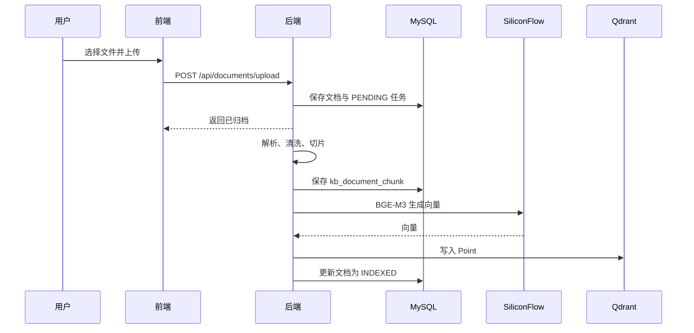

# NPC Base 知识库项目流程说明

本文档描述当前第一阶段已完成的真实运行方式。系统核心是 RAG：先检索资料，再按需让大模型根据资料组织答案。

## 1. 系统组成

| 组件 | 职责 |
| --- | --- |
| Vue + Vite | 三栏知识库工作台、会话记录、资料上传和删除确认弹窗 |
| Spring Boot | 文件处理、任务调度、检索、会话持久化、模型调用编排 |
| MySQL | 文档、切片、索引任务、会话和消息的持久化数据 |
| Qdrant | 保存 BGE-M3 向量并做相似度召回 |
| SiliconFlow | 提供 BGE-M3 Embedding 与 BGE Reranker |
| DeepSeek | 仅在会话开启后，根据召回资料生成自然语言答案 |

Redis 目前不是业务链路的必要组件。

## 2. 两种问答模式

### 本地资料模式（默认）

新会话默认不连接 DeepSeek。用户直接提问后，后端执行向量检索、重排和本地信息提取，再展示命中的资料片段与引用。

这个模式成本低、响应快，适合确认“资料里是否有某段原文”“有哪些地址或接口”。它不具备通用理解和总结能力，因此不能期望它从混杂的多个地址中稳定判断业务含义。

### DeepSeek 增强模式

在当前会话输入 `小c启动`，后端保存该会话的启用状态。后续问题会执行：

1. 使用 BGE-M3 将问题向量化；
2. Qdrant 召回候选切片；
3. 使用 Reranker 选出最相关的少量切片；
4. 将问题、角色提示词和切片上下文提交给 DeepSeek；
5. 保存用户消息、小C答案、引用切片和会话状态。

输入 `小c关闭` 会关闭该会话的 DeepSeek 调用，之后恢复本地资料模式。启用状态跟随会话保存，不影响其他会话。

## 3. 为什么 Qdrant 不能替代 DeepSeek

Qdrant 是向量数据库，不是聊天模型。它回答的是“哪几段资料最像这个问题”，不能可靠回答“这几段里哪一个地址是三医院公网 IP”。

因此：

- BGE-M3 + Qdrant 决定召回是否准确；
- Reranker 决定候选片段的排序是否更贴近问题；
- DeepSeek 决定能否基于片段归纳、判断和解释。

固定格式的问题可以在本地模式增加规则提取，例如只提取 IP、URL、端口或编号；但这只能覆盖预先定义的场景，不能替代大模型的通用总结能力。

## 4. 文档上传与索引

上传资料后并不会在浏览器请求中同步完成全部工作。服务端会先保存文档和任务，然后由后台任务处理：

支持 Markdown、TXT、PDF、DOCX。资料状态通常依次为 `UPLOADED`、`PARSING`、`INDEXING`、`INDEXED`；失败时为 `FAILED`，并记录失败原因。

重新上传同一份资料不会自动去重。若要替换资料，建议先在右侧资料归档中删除旧资料，再上传新版本；或对已有资料执行“重新生成 BGE-M3 向量”。

## 5. 会话与消息保存

左侧展示的是历史会话列表，不是当前对话消息摘要。

- 新对话：创建 `kb_conversation`。
- 发送问题：先立即在前端展示临时用户气泡；后端返回后使用持久化消息替换，避免等待检索时提问消失。
- 每一条用户、小C和系统提示消息保存于 `kb_chat_message`。
- 删除会话会一并删除其消息；删除资料会同步清理文档切片、解析任务、文件和 Qdrant 向量。

## 6. 质量提升的优先顺序

当前第一阶段完成后，建议按以下顺序迭代：

1. 清洗资料：将大段 SQL、无业务价值日志与正文分离，减少噪声。
2. 优化切片：按标题、段落、列表切分，避免一个切片同时混入多个主题或地址。
3. 混合检索：组合关键词检索和向量检索，再用 Reranker 排序。
4. 优化提示词：要求 DeepSeek“只依赖引用资料、先给结论、资料不足时明确说明”。
5. 为 IP、接口、账号等固定字段增加本地规则提取，改善不调用模型时的体验。
6. 再考虑流式输出、多知识库分类、标签过滤、权限与工具调用。

LangChain4j 并不是本阶段必需依赖。它可以在未来用于统一封装模型调用、检索器、流式输出或工具调用；当前项目已自行完成关键 RAG 编排，直接维护更容易排查与控制“小c启动/关闭”规则。

## 7. 常见问题

### 输入“小c启动”仍是本地模式

确认使用的是当前会话、输入没有附加其他文字，并检查后端是否已经重启到最新代码。健康检查中 `chatEnabled` 应为 `true`，且 DeepSeek 配置完整。

### 删除资料后仍能搜到旧内容

先刷新资料列表，再确认删除请求成功。当前服务端会清理 MySQL 切片和 Qdrant 中该文档的 Point；若旧版本在早期代码中被删除过而留下孤儿数据，需要按文档 ID 清理一次旧的 MySQL 切片与 Qdrant Point。

### 本地模式结果看起来不如 DeepSeek 自然

这是预期行为。本地模式是检索与规则提取，不做通用语义归纳；需要准确总结时使用 `小c启动`。
